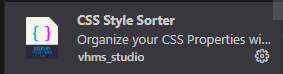

<div align="center">
<h1>
<a href="#"></a>

  <b>CSS Style Sorter</b>
  
[](#)
[](#)

</h1>

  <p>Organize your CSS properties with just one click using this extension for **Visual Studio Code**.</p>

   <a href="#"></a>

</div>

## {  } Index
[](https://github.com/victorhmszzero/Css-Style-Sorter)
[](https://github.com/victorhmszzero/Css-Style-Sorter/blob/main/README.pt-br.md)

**CSS Style Sorter** é uma extensão para o **Visual Studio Code** projetada para simplificar e agilizar a organização de propriedades em arquivos CSS. Ela automatiza o processo de reorganização de propriedades CSS com apenas um clique, seguindo uma lista pré-definida que é completamente personalizável.

- Organize a partir de uma [lista pré-definida](https://github.com/victorhmszzero/Css-Style-Sorter/orderList.js) completamente personalizável!
- Remova linhas em branco desnecessárias.
- Elimine propriedades duplicadas.

A ideia por trás do **CSS Style Sorter** surgiu da experiência de lidar com projetos web complexos, nos quais a organização eficiente das propriedades CSS era um desafio constante. A extensão foi desenvolvida para fornecer uma solução simples e rápida, permitindo uma organização com facilidade, economizando tempo e mantendo uma base de código mais limpa.

## 💻 Instalação

### Usando o Painel de Extensões

1. Abra o painel de extensões do **Visual Studio Code.** `Ctrl + Shift + X`
2. Pesquise por **CSS Style Sorter**.
4. Instale a extensão.

   [](#)

### Instalação Manual

1. Baixe a versão desejada em [releases](https://github.com/victorhmszzero/Css-Style-Sorter/releases).
2. Copie a pasta para **.vscode\extensions**
   >C:\Users\ SEU_NOME \ .vscode\extensions
3. Reinicie o Visual Studio Code.

## 🛠 Instruções
Após instalar a extensão, abra um arquivo CSS.

Você consegue iniciar a extensão de duas formas:

1. Usando o atalho `Ctrl + Alt + O`
2. Navegando na guia **Help > Show All Commands** ou `Ctrl + Shift + P` e digitando:

```txt
Organize with CSS Style Sorter
```
<div align="center">

[](#)

</div>

> *(Opcional) Configure a ordem de suas propriedades, em Extensions > CSS Style Sorter ⚙ > Extension Settings*.

## 🤝 Contribua

Encontrou um problema ou tem uma sugestão? Sinta-se à vontade para abrir uma [issue](https://github.com/victorhmszzero/Css-Style-Sorter/issues) ou enviar um [pull request](https://github.com/victorhmszzero/Css-Style-Sorter/pulls).

## 📌 Licença

Este projeto está licenciado sob a Licença MIT - veja o arquivo [LICENSE](https://github.com/victorhmszzero/Css-Style-Sorter/blob/main/LICENSE) para detalhes.
